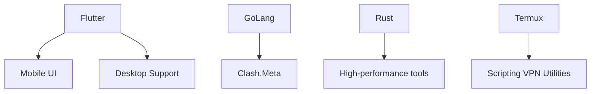

<h1 align="center">🚀 Hey, I'm Taief aka Mushfiqtaief 👨‍💻</h1>

<p align="center">
  
</p>

<p align="center">
  
</p>

---

## 🧑‍💻 About Me

```yaml
Name: Taief
Alias: Mushfiqtaief
Tech Stack: [Flutter, Dart, Go, Rust, VPNs, Android]
Open Source: Contributor & Customizer
Motto: "Break things to learn how to fix them."
```

---

## 🛠️ My Favorite Tech Stack

<p align="center">
  
</p>

---

## 📈 My GitHub Stats

<div align="center">
  
  
  
</div>

---

## 🔥 Current Project

- 🛠️ [Experiment-Cats](https://github.com/Mushfiqtaief/Experiment-Cats) - A custom Clash/FlClash fork with enhanced VPN handling and UI tweaks

---

## 🎯 Currently Exploring



---

## 🌐 Contact & Links

<p align="center">
  <a href="mailto:yourname@example.com"></a>
  <a href="https://t.me/yourhandle"></a>
  <a href="https://github.com/Mushfiqtaief"></a>
</p>

<p align="center">
  
</p>

<p align="center">
  
</p>